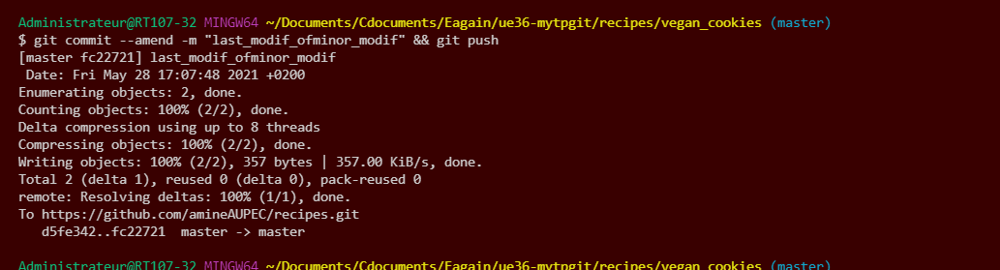

vendredi 28 mai 2021 - Souiden cours1 TP1 -intervenant git -UE36 --distanciel
labynocle

*Notes :cloner en ssh (recommandé)*

1. trouver la commande  :
`git clone git@github.com:amineAUPEC/recipes.git`

1. trouver la commande git permettant de configurer votre nom et votre mail
    - La commande git permettant de configurer notre nom et notre adresse mail est  :  
    `git config --global user.name "Amine XXXX"`  
    `git config --global user.email "amine@u-pec.fr"`
2. savez vous où retrouver ces informations sur votre ordinateur ?
    - Les informations sont dans :
        - `~/.gitconfig`   
 
3. créer un commit modifiant la recette des vegan cookie (changer la quantité de chocolat)
    - `git add . && git commit -m changequantity_vegancookies && git push`
 

4. créer un commit effacant la recette coco_rocks
    - `cd recipes/coco_rocks/ && git rm README.md && git commit -m delete_coco_rocks && git push`
 
5. créer un commit renommant banana_chocolate_cake en banana_cake
    - `git mv banana_chocolate_cake banana_cake && git commit -m rename_banana_chocolate_cake && git push`
 
6. créer un commit qui annule le commit effacant la recette coco_rocks
    - `git revert 9cc85d8a700e3a33e4a11baf4db679e695b91cba && git push`
 
7. trouver la commande git affichant les modifications de votre commit
    - `git show`
 
8. trouver la commande git affichant la liste des fichiers modifiés d’un commit
    - `git show --name-only $9cc85d8a700e3a33e4a11baf4db679e695b91cba`
 
9. trouver la commande git listant l’historique des commits modifiant un fichier
    - `git log $name_of_file`  

10. trouver la commande git affichant les 8 derniers commits sur le format: 
    - `git log -8 --oneline --pretty=" %h is the id | the date is %cd | committed %h | message %s"` 
![![gitlogcommitted_date]](./images/gitlogcommitted_date.png)

11. trouver la commande git affichant uniquement vos commits
    - `git log --author=amineAUPEC `

12. trouver la commande git pour renommer le commit message de votre dernier commit
    - `git commit --amend -m "$New commit message." && git push` 
        - S'il y a des modifs :
            - `git add . && git commit --amend -m "minor_modifofminor_modif" && git push`

13. afficher à nouveau les git logs et regardez les commit ID, que constatez vous et que comprennez vous ?
    - `git log`  
    -  on remarque que les hash servent de commitID et qu'ils sont nouveaux, c'est des identidiants uniques (uid)

14. y a t’il une commande pour afficher qui a écrit chaque ligne d’un fichier?
    - `git blame $filename`

15. créer:
15. A. un commit qui modifie la recette de cheese_naans (quantite d’oeuf)
    - `git add . && git commit -m changequantity_cheese_naans_eggs `
15. B. un commit qui modifie la recette de cheese_naans (quantite de farine)
    - `git add . && git commit -m changequantity_cheese_naans_flour `
15. C. un commit qui modifie la recette de cheese_naans (quantite feta)
    - `git add . && git commit -m changequantity_cheese_naans_feta `
15. D. trouver les commandes vous permettant de merger ces 3 derniers commits en un seul
    - `git rebase -i HEAD~3 && git push --force origin HEAD `

15. **A Ce Stade Vous Avez Les Bases Pour Manipuler Git Localement**

16. trouver la commande pour push vos modifications sur github
17. changer le commit message du dernier commit et repousser vos modifications
    - que se passe t’il ? pourquoi ?
    - comment contourner le problème ?
        - voyez vous le danger derrière cette opération ?
18. directement via l’interface Github, modifiez un fichier et créez un commit
    - trouver la commande pour récupérer dans votre clone locale les modifications que vous avez fait sur Github    
19. trouver les commandes git pour créer une branche: recipe/carrot_cake
    - créer un commit en ajoutant une recette de carrot cake
    - trouvez la commande pour pousser votre branche sur github
    - créer une pull request sur Github, pour que le commit que vous avez fait se retrouve sur votre branche principale (master)
    - mergez en utilisant l’option “squash and merge”
    - sur votre clone locale, mettez a jour votre branche principale (master)
